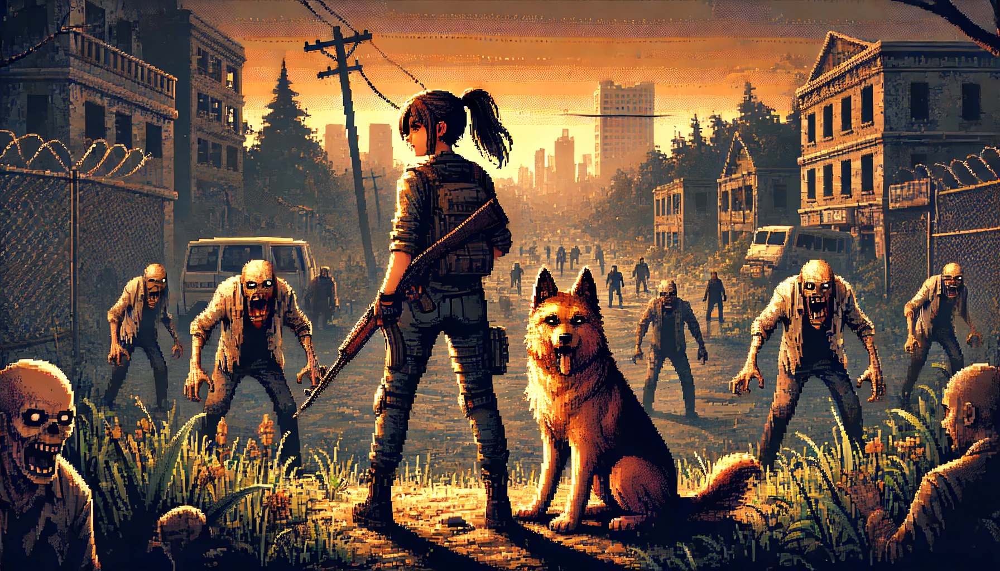

# Zombie Land

## Description
Zombie Land est un jeu où le joueur contrôle un héros qui doit survivre dans un environnement rempli de zombies. Le héros est accompagné de chiens qui le suivent et qu'il doit proteger. Le joueur peut également tirer des missiles pour éliminer les zombies. Le jeu comporte un menu de démarrage, un écran de victoire et un écran de défaite.



## Fonctionnalités
- Contrôle du héros avec la souris
- Chiens qui suivent le héros et évitent les obstacles
- Zombies qui errent et évitent les obstacles tout en évitant les bords
- Missiles qui ciblent et détruisent les zombies
- Menu de démarrage
- Écran de victoire
- Écran de défaite
- Sliders pour ajuster les paramètres du jeu (vitesse, force, etc.)
- Affichage du score, du nombre de zombies et de chiens

## Installation
1. Clonez le dépôt :
   ```bash
   git clone https://github.com/JsFn99/ZombieLand
   ```
2. Ouvrez le dossier du projet :
   ```bash
   cd zombie-game
   ```
3. Ouvrez le fichier `index.html` dans votre navigateur pour lancer le jeu.

## Lien du jeu
Ou bien ouvrez le lien suivant : [Game](https://jsfn99.github.io/ZombieLand/)

## Utilisation
- Utilisez la souris pour déplacer le héro.
- Cliquez sur l'écran de démarrage pour commencer une nouvelle partie.
- Utilisez les touches suivantes pour interagir avec le jeu :
  - `m` : Ajouter un chien
  - `s` : Activer/désactiver le mode serpent pour les chiens
  - `z` : Ajouter un zombie
  - `o` : Ajouter un obstacle à la position de la souris
  - `b` : Tirer un missile
  - `d` : Activer/désactiver le mode debug

## Dépendances
- [p5.js](https://p5js.org/) : Une bibliothèque JavaScript pour la création graphique et interactive.


